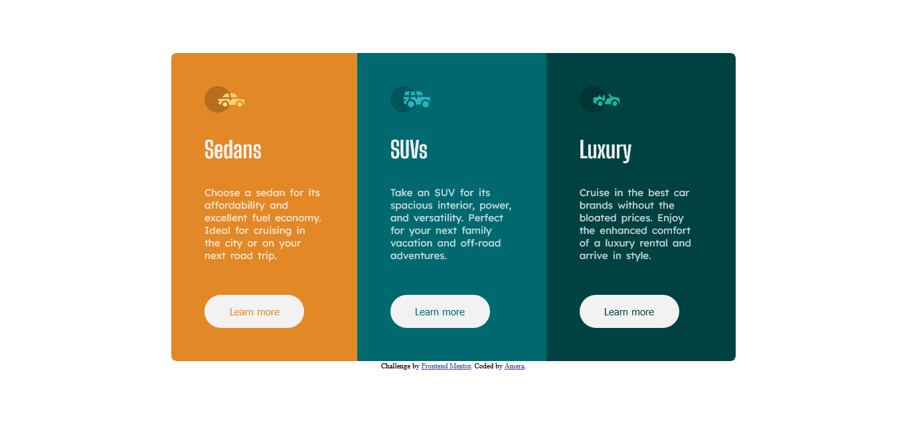

# Frontend Mentor - 3-column preview card component solution

This is a solution to the [3-column preview card component challenge on Frontend Mentor](https://www.frontendmentor.io/challenges/3column-preview-card-component-pH92eAR2-).  

## Table of contents

- [Overview](#overview)
  - [The challenge](#the-challenge)
  - [Screenshot](#screenshot)
  - [Links](#links)
- [My process](#my-process)
  - [Built with](#built-with)
  - [What I learned](#what-i-learned)
  - [Continued development](#continued-development)
- [Author](#author)


## Overview
It was easy light challenge to do. 
### The challenge

Users should be able to:

- View the optimal layout depending on their device's screen size
- See hover states for interactive elements //can't do this as i don't want to use link so I am looking for different way.

### Screenshot



### Links

- Solution URL: [github solution URL here](https://github.com/aammeerraakhater/3-column-preview-card-component.git)
- Live Site URL: don't have one now sry

## My process

### Built with

- Semantic HTML5 markup
- CSS custom properties
- Flexbox
### What I learned

  How to convert from desktop to tablet and to mobile was a bit challenging like how can i do that with the minimal code possible:

```literally the container that hold all the other smaller containers 

```html
<div class="biggercontainer">
```
```css
```just give it flex-direction: column;  and et voila 
@media only screen and (max-width:870px) {
    .biggercontainer{
        max-width:90%;  
        flex-direction: column;  
    }
}
``` 
also it is much eaiser to just setup your project like this in the very beggining
*, ::after, ::before{
    box-sizing: border-box;
    margin:0;
    padding:0;
}
:root{
    --BrightOrange: hsl(31, 77%, 52%);
    --DarkCyan: hsl(184, 100%, 22%);
    --VeryDarkCyan: hsl(179, 100%, 13%);
    
    /* ### Neutral */
    
    --TransparentWhite: hsla(0, 0%, 100%, 0.75); /* (paragraphs)*/
    --VeryLightGray : hsl(0, 0%, 95%);/*(background, headings, buttons)*/
    
}
``to give child color that its parent have 
    background-color:inherit; /*for background color*/
    color:inherit; /*for color*/


### Continued development

- See hover states for interactive elements
 //can't do this as i don't want to use link so I am looking for different way.
 :hover and other selectors?


## Author

- Frontend Mentor - [@aammeerraakhater](https://www.frontendmentor.io/profile/aammeerraakhater)


